# CSVNodeEditor データフロー図

## プラグイン初期化フロー

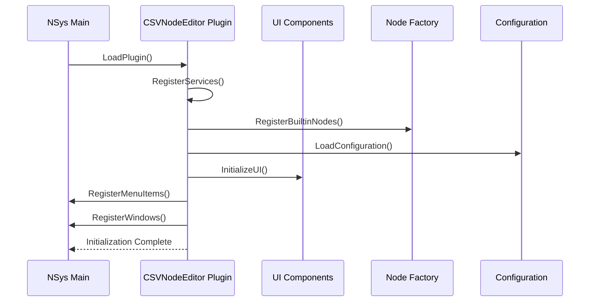

## ワークフロー作成フロー

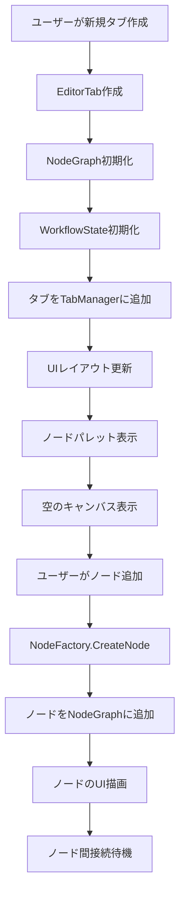

## CSVファイル読み込みフロー

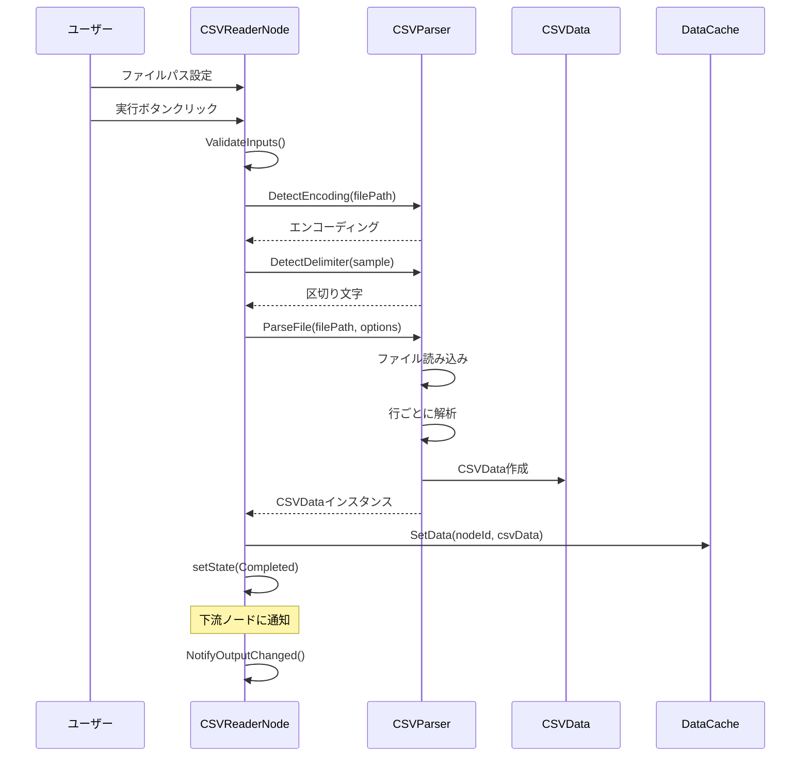

## データ処理パイプライン実行フロー

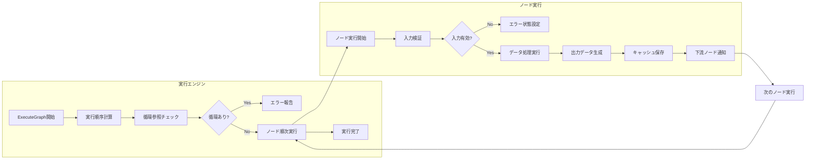

## ノード間データ伝播フロー

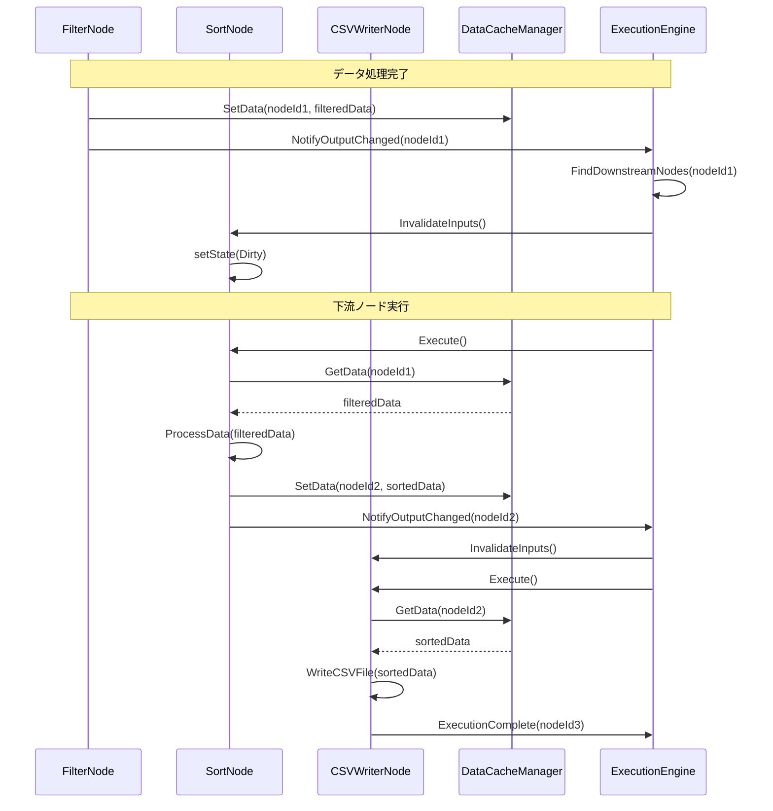

## メモリ管理フロー

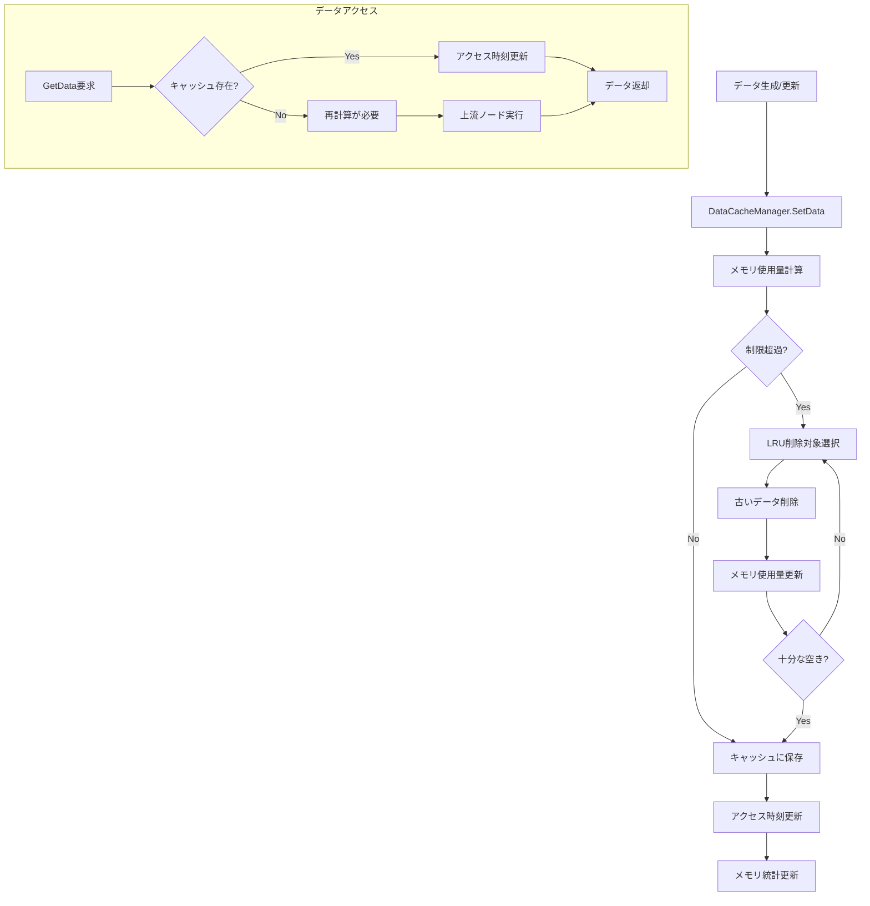

## ストリーミング処理フロー

```mermaid
sequenceDiagram
    participant User as ユーザー
    participant Node as 大容量CSVノード
    participant Stream as StreamingReader
    participant Processor as DataProcessor
    participant UI as ProgressUI

    User->>Node: 大容量ファイル指定
    Node->>Stream: StreamingCSVReader作成
    Stream->>Stream: ファイルサイズ取得
    
    loop チャンク単位で処理
        Node->>Stream: ReadNextChunk()
        Stream-->>Node: データチャンク
        Node->>Processor: ProcessChunk(chunk)
        Processor-->>Node: 処理済みチャンク
        Node->>Node: 結果を累積
        
        Node->>UI: UpdateProgress(processed/total)
        UI->>UI: プログレスバー更新
        
        Node->>Node: CheckCancellation()
        alt キャンセル要求
            Node->>Node: 処理中断
            break
        end
    end
    
    Node->>Node: 最終結果生成
    Node-->>User: 処理完了通知
```

## エラーハンドリングフロー

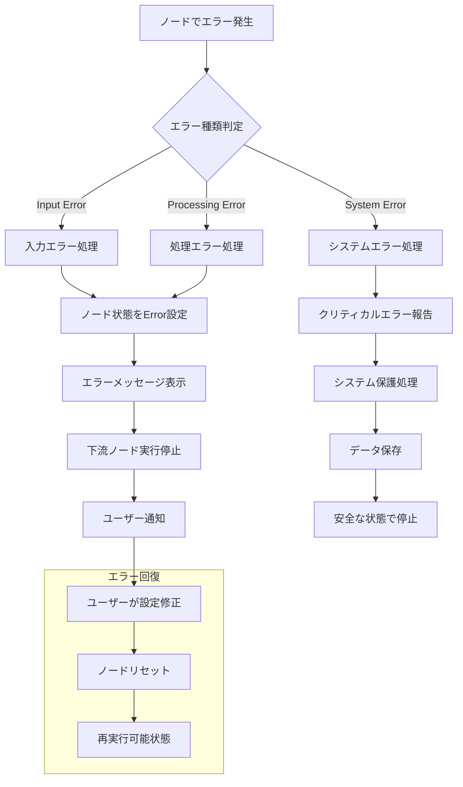

## プロジェクト保存/読み込みフロー

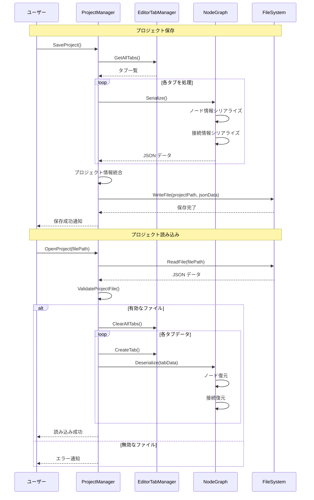

## ノード接続管理フロー

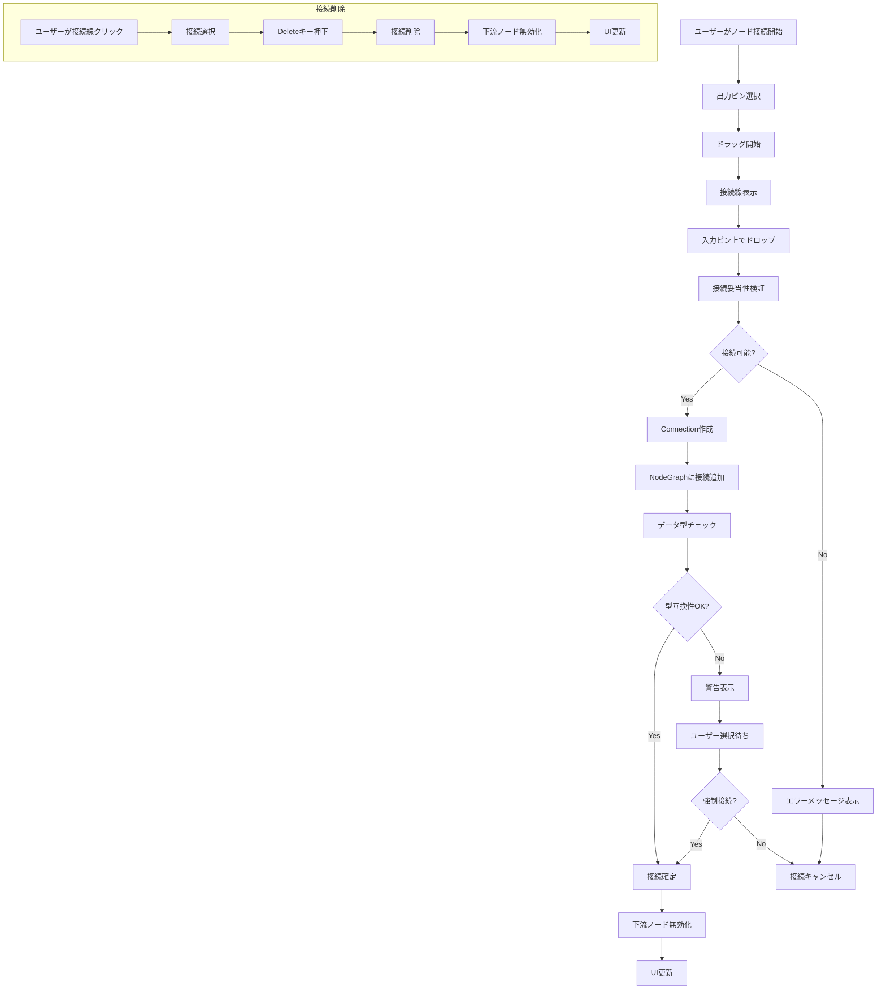

## データプレビュー更新フロー

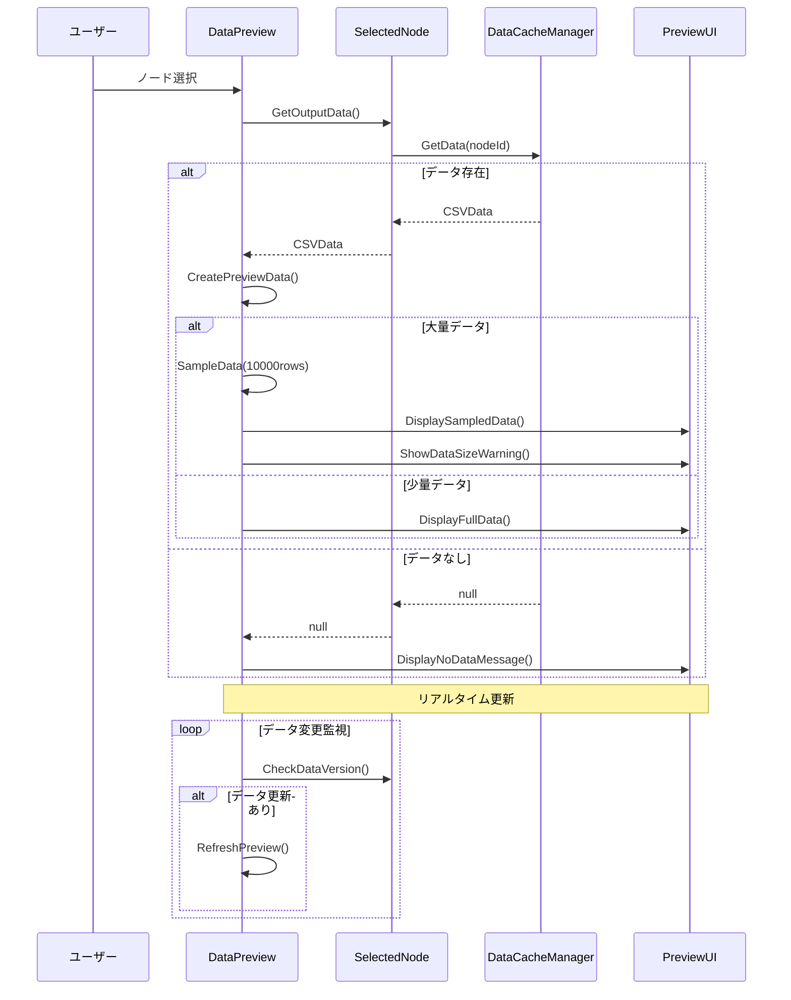

## パフォーマンス監視フロー

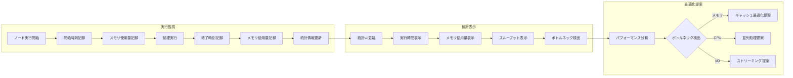

## undo/Redo 操作フロー

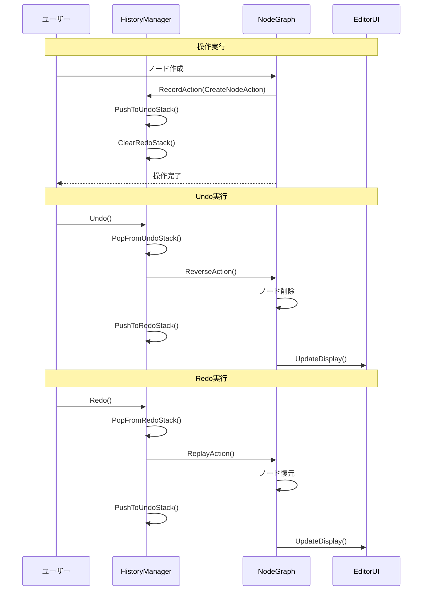

## 並列処理フロー

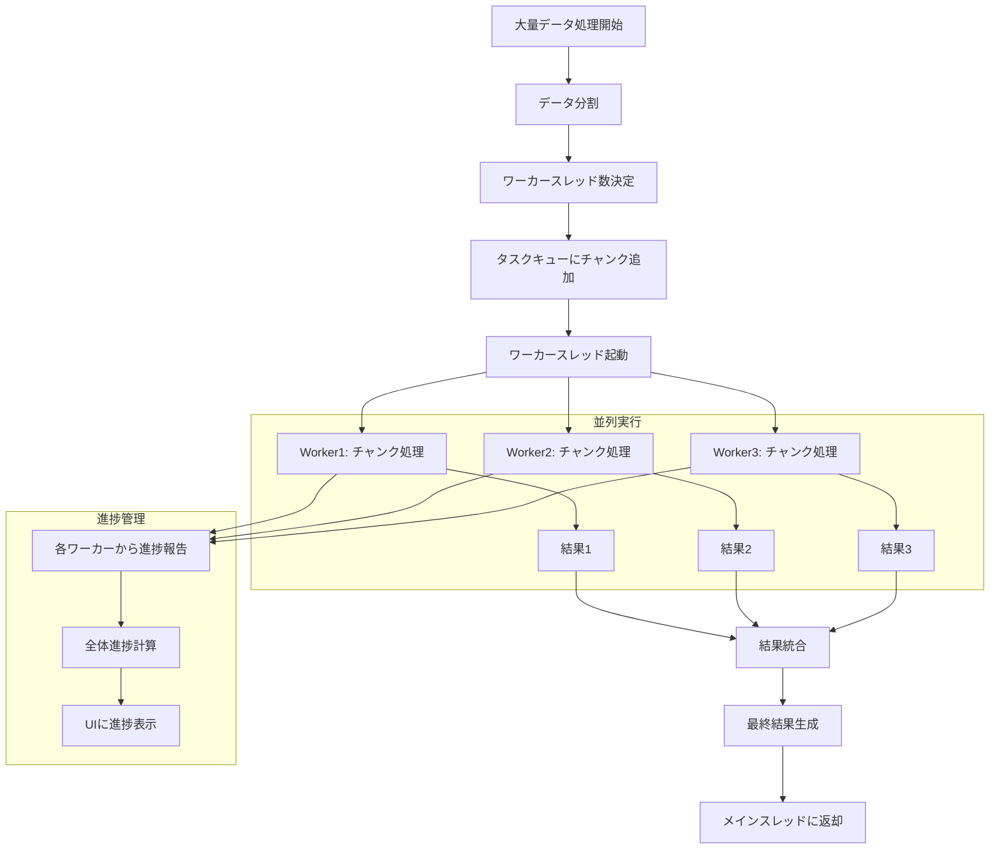