# NSys データフロー図

## システムブートストラップフロー

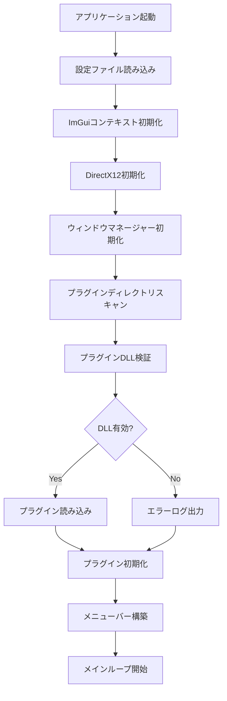

## プラグイン読み込みフロー

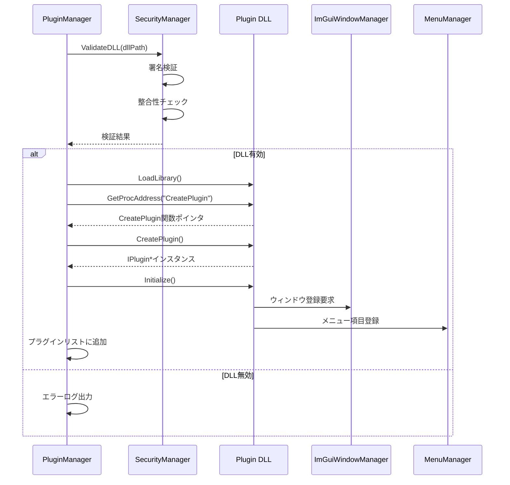

## メインループ データフロー

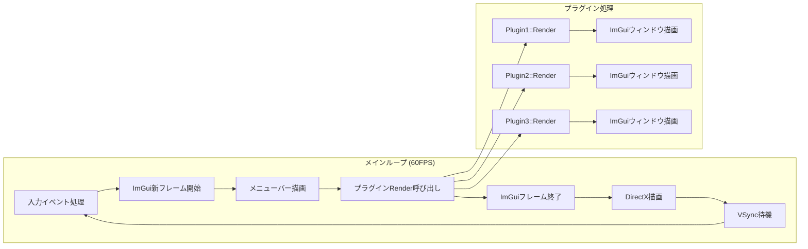

## プラグイン間通信フロー

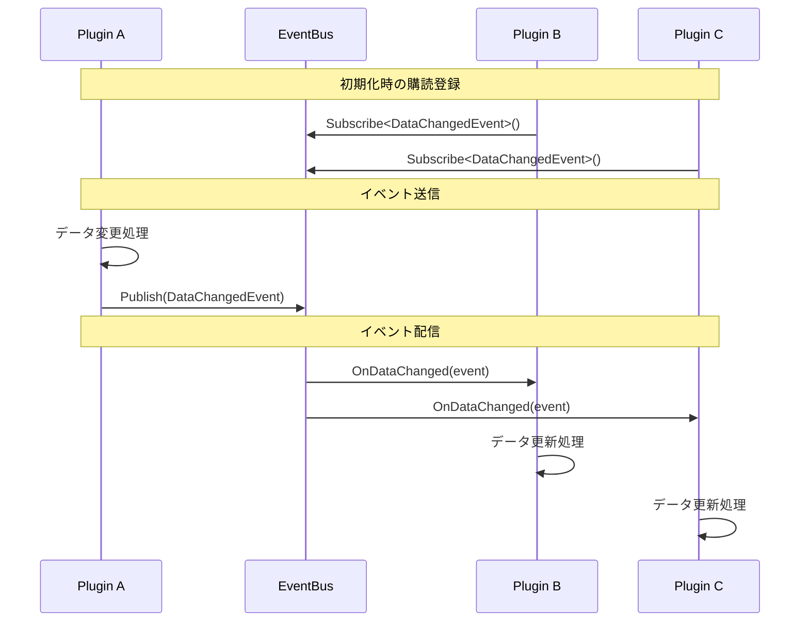

## ファイルシステムアクセスフロー

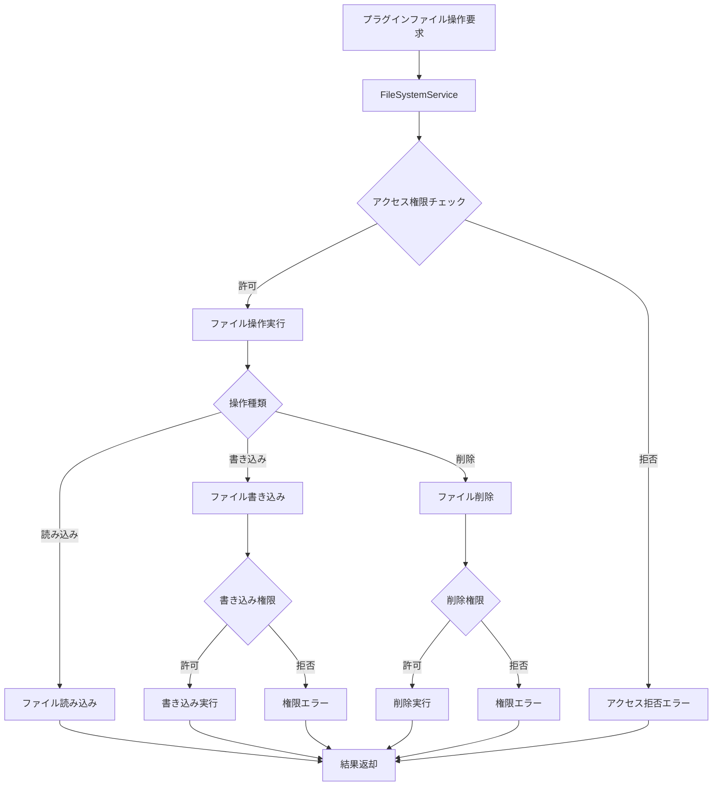

## メモリ管理フロー

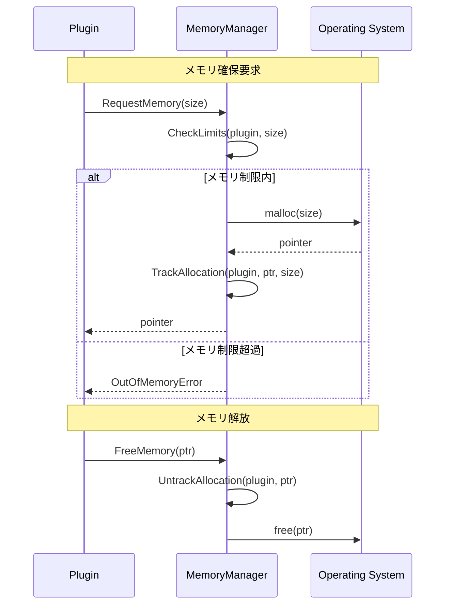

## エラーハンドリングフロー

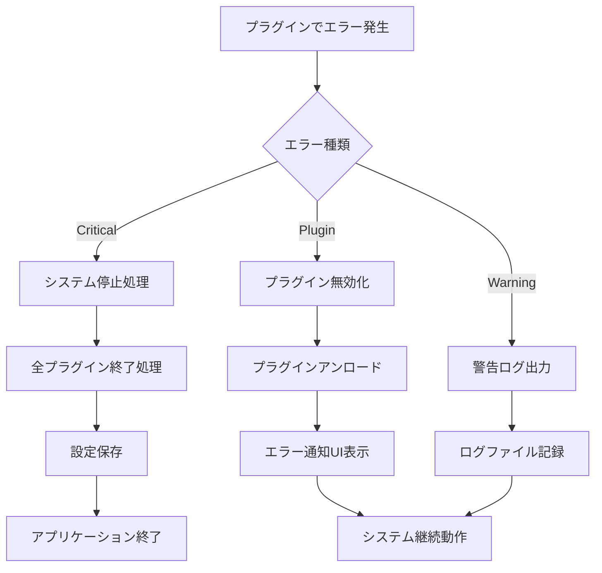

## 設定管理フロー

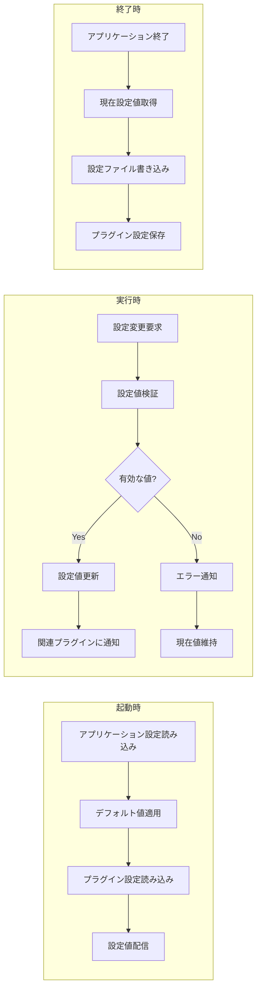

## ローカライゼーションフロー

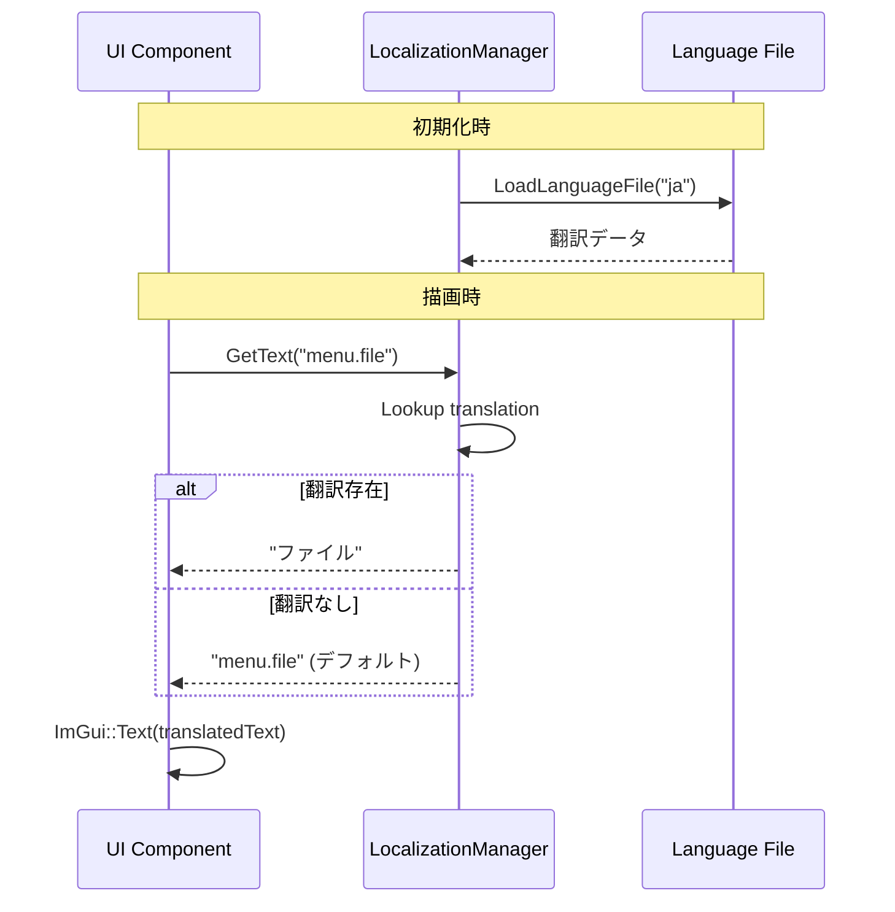

## ログ出力フロー

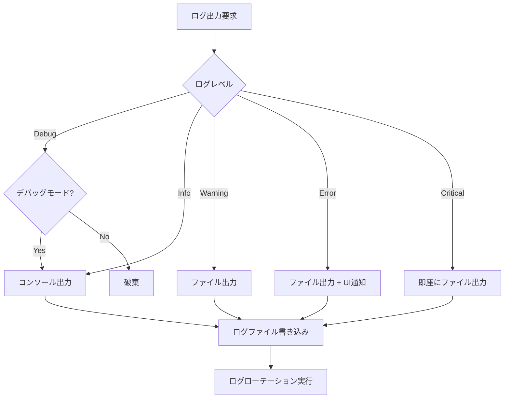

## プラグイン アンロードフロー

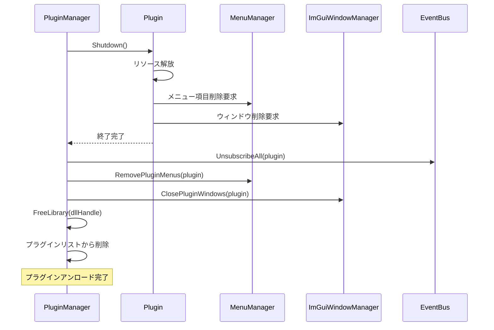

## データ永続化フロー

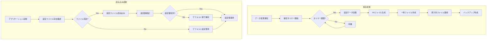