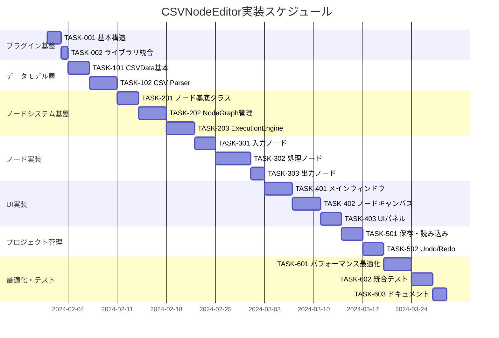

# CSVNodeEditor 実装タスク

## 概要

全タスク数: 24
推定作業時間: 96時間
クリティカルパス: TASK-001 → TASK-002 → TASK-101 → TASK-102 → TASK-201 → TASK-202 → TASK-203 → TASK-301 → TASK-401

## 前提条件

- NSysメインアプリケーションが完成している（nsys-tasks.mdの全タスクが完了）
- プラグインAPIが利用可能
- ImGui、ImNodes、ImPlotライブラリが利用可能

## タスク一覧

### フェーズ1: プラグイン基盤

#### TASK-001: CSVNodeEditorプラグイン基本構造

- [ ] **タスク完了**
- **タスクタイプ**: TDD
- **要件リンク**: REQ-001, REQ-002, REQ-004
- **依存タスク**: NSys TASK-501 (PluginTest完了)
- **実装詳細**:
  - CSVNodeEditorプラグインクラス実装（NSys::PluginBase継承）
  - DLL基本構造とエクスポート関数
  - NSys APIとの基本連携
  - プラグイン情報・メタデータ設定
- **テスト要件**:
  - [ ] 単体テスト: プラグイン読み込み・アンロード
  - [ ] 統合テスト: NSysでの正常読み込み確認
  - [ ] 単体テスト: APIバージョン互換性チェック
- **完了条件**:
  - [ ] NSysメニューに「CSVNodeEditor」項目が表示される
  - [ ] プラグインが正常に読み込み・アンロード可能
  - [ ] エラーなくDLLが生成される

#### TASK-002: 外部ライブラリ統合

- [ ] **タスク完了**
- **タスクタイプ**: DIRECT
- **要件リンク**: 技術要件（ImNodes, ImPlot, nlohmann::json）
- **依存タスク**: TASK-001
- **実装詳細**:
  - ImNodes サブモジュール設定とビルド統合
  - ImPlot サブモジュール設定とビルド統合  
  - nlohmann::json 統合（ヘッダーオンリー）
  - プロジェクト設定とインクルードパス調整
- **テスト要件**:
  - [ ] ビルドテスト: 全ライブラリのコンパイル確認
  - [ ] 統合テスト: ImNodesの基本動作確認
  - [ ] 統合テスト: ImPlotの基本動作確認
- **完了条件**:
  - [ ] 全外部ライブラリがエラーなくビルドされる
  - [ ] サンプルコードで各ライブラリが動作する

### フェーズ2: データモデル層

#### TASK-101: CSVData基本実装

- [ ] **タスク完了**
- **タスクタイプ**: TDD
- **要件リンク**: REQ-011, REQ-012, REQ-013, REQ-014
- **依存タスク**: TASK-002
- **実装詳細**:
  - CSVData クラス基本実装
  - データ型推論機能（String, Integer, Float, Boolean, Date）
  - メモリ効率的なデータ構造
  - スレッドセーフアクセス機能
- **テスト要件**:
  - [ ] 単体テスト: データ格納・取得（10万行対応）
  - [ ] 単体テスト: データ型自動推論
  - [ ] パフォーマンステスト: 10万行データの処理時間（30秒以内）
  - [ ] スレッドテスト: 並行アクセステスト
- **エラーハンドリング**:
  - [ ] NULL値・空文字の適切な処理
  - [ ] 不正データ型変換時のエラー処理
- **完了条件**:
  - [ ] 10万行×100列のデータを500MB以下のメモリで処理
  - [ ] データ型推論精度90%以上
  - [ ] スレッドセーフアクセスが機能

#### TASK-102: CSV Parser実装

- [ ] **タスク完了**
- **タスクタイプ**: TDD
- **要件リンク**: REQ-011, NFR-301, NFR-302, NFR-303, EDGE-001, EDGE-002
- **依存タスク**: TASK-101
- **実装詳細**:
  - CSVParser クラス実装
  - エンコーディング自動判定（UTF-8, Shift-JIS）
  - 区切り文字自動判定
  - RFC 4180準拠パーサー
  - ストリーミング読み込み対応
- **テスト要件**:
  - [ ] 単体テスト: 各種エンコーディング解析
  - [ ] 単体テスト: CSV形式バリエーション解析
  - [ ] 統合テスト: Excel出力CSVとの互換性
  - [ ] エラーハンドリングテスト: 不正形式CSVファイル
  - [ ] パフォーマンステスト: 大容量ファイル読み込み
- **エラーハンドリング**:
  - [ ] ファイル読み込みエラー
  - [ ] エンコーディング変換エラー
  - [ ] CSV形式エラー
- **完了条件**:
  - [ ] RFC 4180準拠CSV解析が完全動作
  - [ ] エンコーディング自動判定精度95%以上
  - [ ] Excel互換CSV読み込みが動作

### フェーズ3: ノードシステム基盤

#### TASK-201: ノード基底クラス実装

- [ ] **タスク完了**
- **タスクタイプ**: TDD
- **要件リンク**: REQ-002, REQ-021-026, NodeBase設計
- **依存タスク**: TASK-102
- **実装詳細**:
  - INode インターフェース実装
  - NodeBase 基底クラス実装
  - ピン（入力・出力）管理システム
  - ノード状態管理（Idle, Executing, Completed, Error）
- **テスト要件**:
  - [ ] 単体テスト: ノードライフサイクル管理
  - [ ] 単体テスト: ピン接続・切断機能
  - [ ] 単体テスト: ノード状態遷移
  - [ ] 単体テスト: シリアライゼーション機能
- **完了条件**:
  - [ ] ノード基底クラスが正常動作
  - [ ] ピン管理システムが機能
  - [ ] JSON シリアライゼーションが動作

#### TASK-202: NodeGraph管理システム

- [ ] **タスク完了**
- **タスクタイプ**: TDD
- **要件リンク**: REQ-002, REQ-103, 循環参照検出
- **依存タスク**: TASK-201
- **実装詳細**:
  - NodeGraph クラス実装
  - ノード間接続管理
  - 循環参照検出アルゴリズム
  - 実行順序解決アルゴリズム
- **テスト要件**:
  - [ ] 単体テスト: ノード作成・削除
  - [ ] 単体テスト: 接続作成・削除
  - [ ] 単体テスト: 循環参照検出
  - [ ] パフォーマンステスト: 大規模グラフ（100ノード）処理
- **エラーハンドリング**:
  - [ ] 循環参照発見時の警告表示
  - [ ] 不正な接続試行の適切な拒否
- **完了条件**:
  - [ ] 循環参照が正確に検出される
  - [ ] 実行順序が適切に解決される
  - [ ] 100ノードのグラフが処理可能

#### TASK-203: ExecutionEngine実装

- [ ] **タスク完了**
- **タスクタイプ**: TDD
- **要件リンク**: REQ-201, REQ-202, キャンセル処理, 進捗報告
- **依存タスク**: TASK-202
- **実装詳細**:
  - ExecutionEngine クラス実装
  - ノード並列実行システム
  - データキャッシュ機能
  - 実行キャンセル機能
  - 進捗報告機能
- **テスト要件**:
  - [ ] 単体テスト: ノード実行順序
  - [ ] 単体テスト: 並列実行機能
  - [ ] 単体テスト: キャンセル機能
  - [ ] 統合テスト: 複雑なワークフロー実行
  - [ ] パフォーマンステスト: データフィルタリング1秒以内
- **UI/UX要件**:
  - [ ] ローディング状態: ノード実行中の視覚的インジケーター
  - [ ] 進捗表示: 全体進捗プログレスバー
  - [ ] エラー表示: 失敗ノードの赤色ハイライト
- **完了条件**:
  - [ ] ノードが適切な順序で実行される
  - [ ] 実行キャンセルが即座に動作
  - [ ] データキャッシュが正常に機能

### フェーズ4: ノード実装

#### TASK-301: 入力ノード実装

- [ ] **タスク完了**
- **タスクタイプ**: TDD
- **要件リンク**: REQ-021, CSVReaderNode仕様
- **依存タスク**: TASK-203
- **実装詳細**:
  - CSVReaderNode クラス実装
  - ファイル選択UI（ImGuiファイルダイアログ）
  - パーシング オプション設定UI
  - ファイル変更監視機能
- **テスト要件**:
  - [ ] 単体テスト: CSV読み込み機能
  - [ ] 統合テスト: 各種エンコーディングファイル
  - [ ] UI テスト: ファイル選択ダイアログ
  - [ ] エラーハンドリングテスト: 不正ファイルパス
- **UI/UX要件**:
  - [ ] ファイルドラッグ&ドロップ対応
  - [ ] ファイル読み込み進捗表示
  - [ ] エラー時の詳細エラーメッセージ表示
  - [ ] プレビュー機能（最初の10行表示）
- **完了条件**:
  - [ ] 各種CSV形式が読み込める
  - [ ] ファイル選択UIが直感的に動作
  - [ ] エラーが適切に報告される

#### TASK-302: 処理ノード実装

- [ ] **タスク完了**
- **タスクタイプ**: TDD
- **要件リンク**: REQ-022, REQ-023, REQ-024, REQ-025
- **依存タスク**: TASK-301
- **実装詳細**:
  - FilterNode クラス実装（条件フィルタリング）
  - SortNode クラス実装（並び替え）
  - AggregateNode クラス実装（集計処理）
  - JoinNode クラス実装（データ結合）
- **テスト要件**:
  - [ ] 単体テスト: フィルター条件（全演算子）
  - [ ] 単体テスト: ソート機能（昇順・降順）
  - [ ] 単体テスト: 集計関数（合計、平均、最大、最小、件数）
  - [ ] 単体テスト: データ結合（内部・外部結合）
  - [ ] パフォーマンステスト: 10万行データでの処理時間
- **UI/UX要件**:
  - [ ] 処理中のリアルタイム進捗表示
  - [ ] 処理結果プレビュー機能
  - [ ] 設定パネルの直感的UI設計
- **エラーハンドリング**:
  - [ ] データ型不整合時の適切なエラー
  - [ ] メモリ不足時のグレースフルデグラデーション
- **完了条件**:
  - [ ] 全処理ノードが正常動作
  - [ ] 大容量データ処理が制限時間内に完了
  - [ ] UI が直感的で使いやすい

#### TASK-303: 出力ノード実装

- [ ] **タスク完了**
- **タスクタイプ**: TDD
- **要件リンク**: REQ-026, CSV出力機能
- **依存タスク**: TASK-302
- **実装詳細**:
  - CSVWriterNode クラス実装
  - ファイル保存ダイアログ
  - エンコーディング・区切り文字設定
  - 上書き・追記モード対応
- **テスト要件**:
  - [ ] 単体テスト: CSV出力機能
  - [ ] 統合テスト: 読み込み→処理→出力の完全フロー
  - [ ] ファイルI/O テスト: 権限・容量エラー処理
- **UI/UX要件**:
  - [ ] 出力設定の詳細UI
  - [ ] 出力完了通知
  - [ ] ファイル保存確認ダイアログ
- **エラーハンドリング**:
  - [ ] ディスク容量不足エラー
  - [ ] ファイルアクセス権限エラー
  - [ ] 出力先ディレクトリ存在チェック
- **完了条件**:
  - [ ] 各種形式でCSV出力が可能
  - [ ] エラー処理が適切に動作
  - [ ] 大容量データの出力が安定動作

### フェーズ5: UI実装

#### TASK-401: メインウィンドウ実装

- [ ] **タスク完了**
- **タスクタイプ**: TDD
- **要件リンク**: REQ-031, REQ-032, REQ-033, REQ-034, REQ-035, REQ-036
- **依存タスク**: TASK-303
- **実装詳細**:
  - CSVNodeEditorWindow メインウィンドウ
  - EditorTabManager（複数タブ管理）
  - NodeCanvas（ImNodesキャンバス）
  - レイアウト管理システム（Docking対応）
- **テスト要件**:
  - [ ] UIテスト: ウィンドウ表示・リサイズ
  - [ ] UIテスト: タブ作成・切り替え・削除
  - [ ] UIテスト: Dockingウィンドウ動作
  - [ ] 統合テスト: NSysとの連携
- **UI/UX要件**:
  - [ ] レスポンシブ: ウィンドウサイズ変更対応
  - [ ] アクセシビリティ: キーボード操作対応
  - [ ] ビジュアル: 統一されたデザインシステム
  - [ ] ユーザビリティ: 直感的な操作フロー
- **完了条件**:
  - [ ] メインウィンドウが正常に表示される
  - [ ] タブシステムが完全に動作する
  - [ ] Docking機能が期待通り動作する

#### TASK-402: ノードキャンバス実装

- [ ] **タスク完了**
- **タスクタイプ**: TDD
- **要件リンク**: REQ-002, ドラッグ&ドロップ, 視覚的フィードバック
- **依存タスク**: TASK-401
- **実装詳細**:
  - ImNodesを使用したノードキャンバス
  - ドラッグ&ドロップによるノード作成
  - ノード接続の視覚的フィードバック
  - ノード選択・移動・削除機能
- **テスト要件**:
  - [ ] UIテスト: ノードドラッグ&ドロップ
  - [ ] UIテスト: ノード接続操作
  - [ ] UIテスト: 複数ノード選択
  - [ ] パフォーマンステスト: 100ノード表示時のFPS
- **UI/UX要件**:
  - [ ] スムーズなアニメーション（ノード移動）
  - [ ] 視覚的フィードバック（接続時のハイライト）
  - [ ] コンテキストメニュー（右クリック）
  - [ ] ズーム・パン機能
- **エラーハンドリング**:
  - [ ] 不正な接続試行時の視覚的警告
  - [ ] ノード作成制限時の適切な通知
- **完了条件**:
  - [ ] ノード操作が直感的に動作
  - [ ] 60FPS でスムーズに描画される
  - [ ] 大量ノード時も操作性を維持

#### TASK-403: UI パネル実装

- [ ] **タスク完了**
- **タスクタイプ**: TDD
- **要件リンク**: REQ-033, REQ-034, REQ-035, REQ-036
- **依存タスク**: TASK-402
- **実装詳細**:
  - NodePalette（利用可能ノード一覧）
  - PropertyPanel（ノード設定パネル）
  - DataPreview（データ内容プレビュー）
  - LogPanel（処理状況・エラーログ）
- **テスト要件**:
  - [ ] UIテスト: 各パネルの表示・非表示
  - [ ] UIテスト: パネル間の連携動作
  - [ ] パフォーマンステスト: 大容量データプレビュー
  - [ ] UIテスト: ログの自動スクロール
- **UI/UX要件**:
  - [ ] レスポンシブレイアウト対応
  - [ ] 検索・フィルター機能（ノードパレット）
  - [ ] データ仮想化（大容量データプレビュー）
  - [ ] ログレベル別カラーリング
- **完了条件**:
  - [ ] 全パネルが完全に動作
  - [ ] 大容量データ（10万行）のプレビューが可能
  - [ ] ログが適切に分類・表示される

### フェーズ6: プロジェクト管理

#### TASK-501: プロジェクト保存・読み込み

- [ ] **タスク完了**
- **タスクタイプ**: TDD
- **要件リンク**: REQ-301, プロジェクトファイル管理
- **依存タスク**: TASK-403
- **実装詳細**:
  - ProjectManager クラス実装
  - JSON形式でのプロジェクト保存
  - ワークフロー・ノード設定の完全復元
  - プロジェクトファイル関連付け
- **テスト要件**:
  - [ ] 単体テスト: プロジェクト保存・読み込み
  - [ ] 統合テスト: 複雑なワークフローの保存・復元
  - [ ] 互換性テスト: バージョン間の互換性
  - [ ] エラーテスト: 破損ファイルの処理
- **UI/UX要件**:
  - [ ] ファイル保存・開くダイアログ
  - [ ] 未保存変更の警告ダイアログ
  - [ ] 最近使用したファイル一覧
- **エラーハンドリング**:
  - [ ] ファイル読み込みエラー時の適切な処理
  - [ ] バージョン不整合時の警告表示
- **完了条件**:
  - [ ] プロジェクトが完全に保存・復元される
  - [ ] ファイルダイアログが正常動作
  - [ ] エラー処理が適切に動作

#### TASK-502: Undo/Redo機能

- [ ] **タスク完了**
- **タスクタイプ**: TDD
- **要件リンク**: REQ-302, 操作履歴管理
- **依存タスク**: TASK-501
- **実装詳細**:
  - HistoryManager クラス実装
  - Command パターンによる操作履歴管理
  - メモリ効率的な履歴ストレージ
  - Undo/Redoスタック管理
- **テスト要件**:
  - [ ] 単体テスト: 各種操作のUndo/Redo
  - [ ] 単体テスト: 履歴スタック管理
  - [ ] メモリテスト: 長時間使用時のメモリリーク
  - [ ] 統合テスト: 複合操作のUndo/Redo
- **UI/UX要件**:
  - [ ] キーボードショートカット（Ctrl+Z, Ctrl+Y）
  - [ ] 履歴一覧表示（オプション）
  - [ ] 操作不可時のグレーアウト表示
- **完了条件**:
  - [ ] 全主要操作がUndo/Redo対応
  - [ ] キーボードショートカットが動作
  - [ ] メモリ使用量が適切に管理される

### フェーズ7: 最適化とテスト

#### TASK-601: パフォーマンス最適化

- [ ] **タスク完了**
- **タスクタイプ**: TDD
- **要件リンク**: NFR-001, NFR-002, NFR-003, NFR-004
- **依存タスク**: TASK-502
- **実装詳細**:
  - メモリ使用量最適化
  - 並列処理の最適化
  - UI描画最適化（60FPS維持）
  - キャッシュシステムの最適化
- **テスト要件**:
  - [ ] パフォーマンステスト: 10万行CSV 30秒以内読み込み
  - [ ] パフォーマンステスト: データフィルタリング 1秒以内
  - [ ] パフォーマンステスト: ノード描画 60FPS維持
  - [ ] メモリテスト: 500MB以下のメモリ使用量
  - [ ] ストレステスト: 5タブ同時使用
- **最適化項目**:
  - [ ] データ構造の最適化
  - [ ] 描画呼び出しの最小化
  - [ ] メモリプールの活用
  - [ ] CPU キャッシュ効率の向上
- **完了条件**:
  - [ ] 全非機能要件を満たす
  - [ ] 大容量データでも応答性を維持
  - [ ] メモリリークが検出されない

#### TASK-602: 統合テストスイート

- [ ] **タスク完了**
- **タスクタイプ**: TDD
- **要件リンク**: 全機能要件の統合検証
- **依存タスク**: TASK-601
- **実装詳細**:
  - E2E テストスイートの実装
  - 典型的なユーザーワークフローテスト
  - エラー条件の網羅的テスト
  - パフォーマンス回帰テスト
- **テスト要件**:
  - [ ] E2Eテスト: CSV読み込み→処理→出力の完全フロー
  - [ ] E2Eテスト: 複雑なデータ処理ワークフロー
  - [ ] エラーハンドリングテスト: 全エラー条件
  - [ ] 互換性テスト: 各種CSV形式・エンコーディング
  - [ ] UI テスト: 全ユーザーインタラクション
- **テストデータ**:
  - [ ] 小容量テストデータ（100行）
  - [ ] 中容量テストデータ（1万行）
  - [ ] 大容量テストデータ（10万行）
  - [ ] エラーケース用不正データ
- **完了条件**:
  - [ ] 全受け入れ基準テストがパスする
  - [ ] エラー処理が完全に動作する
  - [ ] パフォーマンス要件をクリアする

#### TASK-603: ドキュメントとサンプル

- [ ] **タスク完了**
- **タスクタイプ**: DIRECT
- **要件リンク**: ユーザビリティ向上、NFR-303
- **依存タスク**: TASK-602
- **実装詳細**:
  - ユーザーマニュアル作成
  - サンプルCSVファイル・プロジェクトファイル作成
  - チュートリアル動画準備（スクリプト作成）
  - API拡張用開発者ドキュメント
- **完了条件**:
  - [ ] 初心者がチュートリアルで操作を習得できる
  - [ ] サンプルファイルで主要機能を体験できる
  - [ ] カスタムノード開発方法が文書化される

## 実行順序

## 推定工数詳細

### 開発フェーズ別工数
- **フェーズ1 プラグイン基盤**: 12時間（3日間）
- **フェーズ2 データモデル層**: 28時間（7日間）
- **フェーズ3 ノードシステム基盤**: 44時間（11日間）
- **フェーズ4 ノード実装**: 40時間（10日間）
- **フェーズ5 UI実装**: 44時間（11日間）
- **フェーズ6 プロジェクト管理**: 24時間（6日間）
- **フェーズ7 最適化・テスト**: 36時間（9日間）

**総合計**: 228時間（57日間、1日4時間作業想定）

## マイルストーン

1. **M1: プラグイン基盤完成** (TASK-002完了) - CSVNodeEditorプラグインがNSysで起動
2. **M2: データモデル完成** (TASK-102完了) - CSV読み込み・解析が可能
3. **M3: ノードシステム完成** (TASK-203完了) - ノードグラフが実行可能
4. **M4: 基本ノード完成** (TASK-303完了) - 基本的なデータ処理フローが動作
5. **M5: UI完成** (TASK-403完了) - 完全なユーザーインターフェイスが利用可能
6. **M6: 製品機能完成** (TASK-502完了) - プロジェクト保存・Undo/Redoが動作
7. **M7: 製品完成** (TASK-603完了) - リリース可能状態

## リスク管理

### 高リスクタスク
- **TASK-101** (CSVData基本): 10万行データの効率的処理
- **TASK-102** (CSV Parser): 多様なCSV形式への対応
- **TASK-203** (ExecutionEngine): 複雑な並列実行制御
- **TASK-402** (ノードキャンバス): ImNodesの高度な使用

### 軽減策
- 早期プロトタイプによる技術検証
- パフォーマンステストの継続的実施
- 段階的機能実装によるリスク分散
- 外部ライブラリドキュメントの詳細調査

## 品質基準

### 機能品質
- [ ] 全受け入れ基準テスト: 100% パス
- [ ] エラーハンドリング: 全エラーケース対応
- [ ] 互換性: Excel出力CSVとの完全互換

### パフォーマンス品質
- [ ] データ読み込み: 10万行30秒以内（NFR-001）
- [ ] フィルタリング: 1秒以内（NFR-002）
- [ ] UI描画: 60FPS維持（NFR-003）
- [ ] タブ管理: 5タブ同時利用（NFR-004）
- [ ] メモリ使用量: 500MB以下（REQ-403）

### ユーザビリティ品質
- [ ] 直感的操作: 初心者が30分で基本操作習得
- [ ] エラーメッセージ: 解決方法を含む明確なメッセージ
- [ ] レスポンシブ: 全解像度でのレイアウト維持
- [ ] アクセシビリティ: キーボード操作完全対応

## 成功基準

### 技術的成功基準
1. 10万行×100列のCSVファイルを500MB以下のメモリで処理
2. 複雑なデータ処理フローを1秒以内で実行
3. 100個のノードを含むグラフを60FPSで描画
4. 全操作でUndo/Redoが適切に動作

### ユーザー体験成功基準
1. プログラミング未経験者が1時間で基本的なデータ処理を実行可能
2. エラー発生時にユーザーが自力で問題解決可能
3. 大容量データ処理中も操作性を維持
4. プロジェクトファイルでワークフローを完全に保存・共有可能