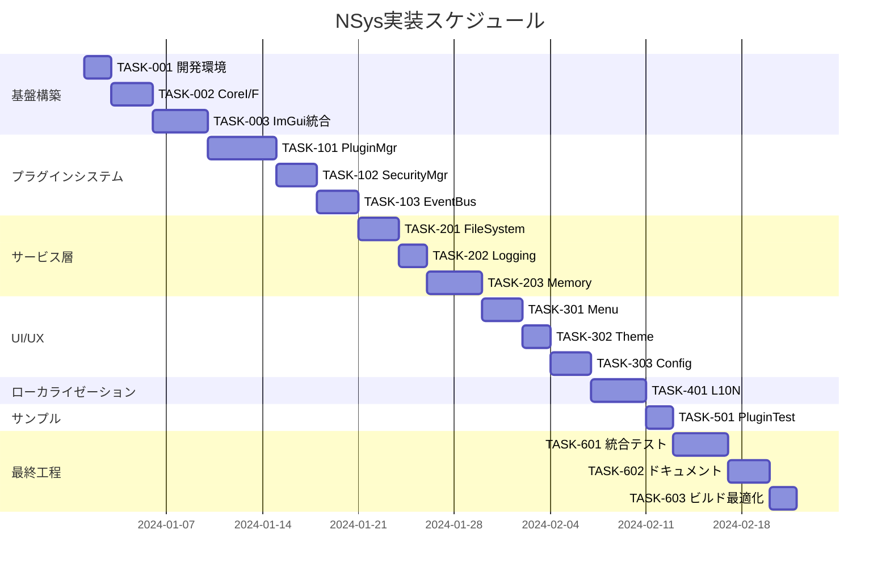

# NSys 実装タスク

## 概要

全タスク数: 28
推定作業時間: 120時間
クリティカルパス: TASK-001 → TASK-002 → TASK-003 → TASK-101 → TASK-102 → TASK-103 → TASK-201 → TASK-202 → TASK-203 → TASK-301

## タスク一覧

### フェーズ1: 基盤構築

#### TASK-001: 開発環境セットアップ

- [ ] **タスク完了**
- **タスクタイプ**: DIRECT
- **要件リンク**: REQ-003, REQ-004
- **依存タスク**: なし
- **実装詳細**:
  - Visual Studio 2019/2022のプロジェクト設定確認
  - Git サブモジュールの初期化とImGui取得
  - CMakeまたはVCPKGによる依存関係管理設定
  - デバッグ・リリース設定の確認
- **テスト要件**:
  - [ ] プロジェクトビルドテスト（Debug/Release）
  - [ ] ImGuiサブモジュール正常性確認
  - [ ] 外部依存関係解決テスト
- **完了条件**:
  - [ ] 全プロジェクトがエラーなしでビルドされる
  - [ ] サブモジュールが適切に初期化されている
  - [ ] setup.bat/setup.ps1が正常動作する

#### TASK-002: CoreシステムI/F実装

- [ ] **タスク完了**
- **タスクタイプ**: TDD
- **要件リンク**: REQ-001, REQ-005, PLUGIN-101
- **依存タスク**: TASK-001
- **実装詳細**:
  - NSys::IPlugin基底インターフェース実装
  - NSys::IMenuProvider, IWindowProvider実装
  - NSys::ServiceLocator設計・実装
  - APIVersion管理システム
- **テスト要件**:
  - [ ] 単体テスト: インターフェース契約テスト
  - [ ] 単体テスト: ServiceLocatorテスト
  - [ ] 統合テスト: プラグインAPI呼び出しテスト
- **UI/UX要件**: なし（インターフェース層のみ）
- **完了条件**:
  - [ ] interfaces.hのコンパイルが成功する
  - [ ] サンプルプラグインが正常にロードされる

#### TASK-003: ImGuiコア統合

- [ ] **タスク完了**
- **タスクタイプ**: TDD
- **要件リンク**: REQ-001, REQ-402, NFR-001
- **依存タスク**: TASK-002
- **実装詳細**:
  - ImGuiWindowManager実装
  - DirectX 12バックエンド統合
  - Win32プラットフォーム統合
  - 60FPSレンダリングループ
- **テスト要件**:
  - [ ] 単体テスト: ウィンドウ管理テスト
  - [ ] パフォーマンステスト: 60FPS維持確認
  - [ ] 統合テスト: レンダリングパイプライン
- **UI/UX要件**:
  - [ ] ローディング状態: アプリケーション起動時スプラッシュ
  - [ ] エラー表示: DirectX初期化失敗時の適切なエラーメッセージ
  - [ ] レスポンシブ: ウィンドウリサイズ対応
- **完了条件**:
  - [ ] ImGuiウィンドウが正常に描画される
  - [ ] 60FPSでの描画が維持される
  - [ ] ウィンドウドッキングが動作する

### フェーズ2: プラグインシステム

#### TASK-101: プラグインマネージャー実装

- [ ] **タスク完了**
- **タスクタイプ**: TDD
- **要件リンク**: REQ-002, PLUGIN-001, PLUGIN-002, PLUGIN-003
- **依存タスク**: TASK-003
- **実装詳細**:
  - PluginManager クラス実装
  - DLL動的読み込み・アンロード機能
  - プラグインライフサイクル管理
  - 依存関係チェック機能
- **テスト要件**:
  - [ ] 単体テスト: プラグイン読み込み・アンロード
  - [ ] 単体テスト: 依存関係解決テスト
  - [ ] 統合テスト: 複数プラグイン同時読み込み
  - [ ] 負荷テスト: 32個プラグイン読み込み限界値テスト
- **エラーハンドリング**:
  - [ ] 不正なDLLファイル処理
  - [ ] プラグイン初期化失敗時の適切な処理
  - [ ] メモリ不足時のグレースフルデグラデーション
- **完了条件**:
  - [ ] プラグインの読み込み時間が3秒以内
  - [ ] プラグイン間依存関係が正しく管理される
  - [ ] EDGE-101: 32個プラグイン制限が機能する

#### TASK-102: セキュリティマネージャー実装

- [ ] **タスク完了**
- **タスクタイプ**: TDD
- **要件リンク**: NFR-101, NFR-102, NFR-103, EDGE-002
- **依存タスク**: TASK-101
- **実装詳細**:
  - SecurityManager クラス実装
  - DLL署名検証機能
  - ファイルアクセス権限制御
  - DLLハイジャック攻撃防止対策
- **テスト要件**:
  - [ ] セキュリティテスト: 不正DLL読み込み防止
  - [ ] セキュリティテスト: ファイルアクセス制御
  - [ ] セキュリティテスト: DLLハイジャック防止
  - [ ] 統合テスト: プラグインマネージャーとの連携
- **エラーハンドリング**:
  - [ ] 署名検証失敗時の適切なエラーメッセージ
  - [ ] 不正アクセス試行の検出と記録
- **完了条件**:
  - [ ] 署名のないDLLが適切に拒否される
  - [ ] ファイルアクセス制限が機能する
  - [ ] セキュリティログが適切に記録される

#### TASK-103: EventBusシステム実装

- [ ] **タスク完了**
- **タスクタイプ**: TDD
- **要件リンク**: PLUGIN-103, ApplicationStartedEvent, PluginLoadedEvent
- **依存タスク**: TASK-102
- **実装詳細**:
  - EventBus クラス実装
  - 型安全なイベント購読・配信システム
  - プラグイン間通信機能
  - イベントフィルタリング機能
- **テスト要件**:
  - [ ] 単体テスト: イベント購読・配信
  - [ ] 単体テスト: 型安全性テスト
  - [ ] 統合テスト: プラグイン間通信
  - [ ] パフォーマンステスト: 大量イベント処理
- **完了条件**:
  - [ ] プラグイン間でデータ共有ができる
  - [ ] イベントの型安全性が保たれる
  - [ ] メモリリークが発生しない

### フェーズ3: サービス層実装

#### TASK-201: ファイルシステムサービス実装

- [ ] **タスク完了**
- **タスクタイプ**: TDD
- **要件リンク**: NFR-102, REQ-303
- **依存タスク**: TASK-103
- **実装詳細**:
  - FileSystemService クラス実装
  - ファイル操作の抽象化
  - アクセス権限チェック機能
  - パス正規化とセキュリティ検証
- **テスト要件**:
  - [ ] 単体テスト: ファイル操作（CRUD）
  - [ ] 単体テスト: アクセス権限チェック
  - [ ] セキュリティテスト: パストラバーサル攻撃防止
  - [ ] 統合テスト: プラグインからのファイルアクセス
- **エラーハンドリング**:
  - [ ] ファイルアクセス拒否時の適切なエラーメッセージ
  - [ ] ディスク容量不足時の処理
- **完了条件**:
  - [ ] プラグインが安全にファイルアクセスできる
  - [ ] セキュリティ制限が適切に機能する

#### TASK-202: ロギングサービス実装

- [ ] **タスク完了**
- **タスクタイプ**: TDD
- **要件リンク**: REQ-201, NFR-301
- **依存タスク**: TASK-201
- **実装詳細**:
  - LoggingService クラス実装
  - ログレベル管理（Debug, Info, Warning, Error, Critical）
  - ファイルローテーション機能
  - プラグイン別ログ分離
- **テスト要件**:
  - [ ] 単体テスト: ログレベル管理
  - [ ] 単体テスト: ファイルローテーション
  - [ ] 統合テスト: プラグインからのログ出力
  - [ ] パフォーマンステスト: 高頻度ログ出力
- **UI/UX要件**:
  - [ ] ログビューアーウィンドウの実装（オプション）
  - [ ] リアルタイムログ表示機能
- **完了条件**:
  - [ ] デバッグモードで詳細ログが出力される
  - [ ] ログファイルが適切にローテーションされる
  - [ ] プラグイン別にログが分離される

#### TASK-203: メモリマネージャー実装

- [ ] **タスク完了**
- **タスクタイプ**: TDD
- **要件リンク**: NFR-003, EDGE-004, EDGE-101
- **依存タスク**: TASK-202
- **実装詳細**:
  - MemoryManager クラス実装
  - メモリ使用量監視機能
  - プラグイン別メモリ制限
  - メモリリーク検出機能
- **テスト要件**:
  - [ ] 単体テスト: メモリ使用量監視
  - [ ] 単体テスト: メモリ制限エンフォース
  - [ ] 統合テスト: プラグインメモリ管理
  - [ ] ストレステスト: メモリリーク検証
- **エラーハンドリング**:
  - [ ] メモリ制限超過時の適切な処理
  - [ ] メモリリーク検出時の警告表示
- **完了条件**:
  - [ ] 実行時メモリ使用量が1GB以下
  - [ ] プラグインあたり100MB制限が機能
  - [ ] メモリリークが検出・報告される

### フェーズ4: UI・UX実装

#### TASK-301: メニューマネージャー実装

- [ ] **タスク完了**
- **タスクタイプ**: TDD
- **要件リンク**: REQ-101, PLUGIN-102
- **依存タスク**: TASK-203
- **実装詳細**:
  - MenuManager クラス実装
  - プラグインメニュー項目登録機能
  - メニュー階層管理
  - キーボードショートカット対応
- **テスト要件**:
  - [ ] 単体テスト: メニュー項目登録・削除
  - [ ] 単体テスト: キーボードショートカット
  - [ ] 統合テスト: プラグインメニュー統合
  - [ ] UIテスト: メニュー項目表示確認
- **UI/UX要件**:
  - [ ] メニュー項目のローカライゼーション対応
  - [ ] アクセシビリティ: キーボード操作対応
  - [ ] ビジュアル: ImGuiスタイル統一
- **完了条件**:
  - [ ] プラグインメニューが適切に表示される
  - [ ] キーボードショートカットが動作する
  - [ ] メニューの多言語表示が機能する

#### TASK-302: テーママネージャー実装

- [ ] **タスク完了**
- **タスクタイプ**: TDD
- **要件リンク**: REQ-301, REQ-302, NFR-201
- **依存タスク**: TASK-301
- **実装詳細**:
  - ThemeManager クラス実装
  - ImGuiテーマ切り替え機能
  - カスタムフォント読み込み機能
  - 日本語フォント自動設定
- **テスト要件**:
  - [ ] 単体テスト: テーマ切り替え機能
  - [ ] 単体テスト: フォント読み込み機能
  - [ ] 視覚テスト: 日本語表示確認
  - [ ] 統合テスト: プラグインとのテーマ連携
- **UI/UX要件**:
  - [ ] ダークテーマ・ライトテーマ対応
  - [ ] 高DPI環境での適切な表示
  - [ ] 日本語フォントの美しいレンダリング
- **完了条件**:
  - [ ] テーマが動的に切り替えられる
  - [ ] 日本語が適切に表示される
  - [ ] カスタムフォントが正常に読み込まれる

#### TASK-303: 設定マネージャー実装

- [ ] **タスク完了**
- **タスクタイプ**: TDD
- **要件リンク**: REQ-303, NFR-302, ConfigurationChangedEvent
- **依存タスク**: TASK-302
- **実装詳細**:
  - ConfigurationManager クラス実装
  - INIファイル形式での設定保存
  - プラグイン別設定管理
  - 設定変更通知システム
- **テスト要件**:
  - [ ] 単体テスト: 設定保存・読み込み
  - [ ] 単体テスト: INIファイルパース
  - [ ] 統合テスト: プラグイン設定連携
  - [ ] 持続性テスト: 設定の永続化確認
- **UI/UX要件**:
  - [ ] 設定UI画面の実装（オプション）
  - [ ] 設定値の検証とエラーメッセージ表示
- **完了条件**:
  - [ ] 設定がINIファイルに適切に保存される
  - [ ] アプリケーション再起動で設定が復元される
  - [ ] プラグイン別設定が分離管理される

### フェーズ5: ローカライゼーション

#### TASK-401: ローカライゼーションマネージャー実装

- [ ] **タスク完了**
- **タスクタイプ**: TDD
- **要件リンク**: NFR-201, LanguageChangedEvent
- **依存タスク**: TASK-303
- **実装詳細**:
  - LocalizationManager クラス実装
  - 多言語リソースファイル管理
  - 動的言語切り替え機能
  - フォールバック機能（英語→日本語）
- **テスト要件**:
  - [ ] 単体テスト: 翻訳文字列取得
  - [ ] 単体テスト: 言語切り替え機能
  - [ ] 統合テスト: UI要素の多言語表示
  - [ ] 視覚テスト: 各言語での表示確認
- **UI/UX要件**:
  - [ ] 言語切り替えUI実装
  - [ ] 文字列の長さ変化に対応したレイアウト
  - [ ] 右から左へのレイアウト対応（将来対応）
- **完了条件**:
  - [ ] 日本語・英語の切り替えが動作する
  - [ ] 全UI要素が適切に翻訳される
  - [ ] 翻訳ファイルが正しく読み込まれる

### フェーズ6: プラグインサンプル

#### TASK-501: PluginTestプラグイン実装

- [ ] **タスク完了**
- **タスクタイプ**: TDD
- **要件リンク**: プラグインシステム検証
- **依存タスク**: TASK-401
- **実装詳細**:
  - 基本的なプラグインの実装例
  - NSys::PluginBase基底クラス使用
  - メニュー登録機能の実証
  - ウィンドウ表示機能の実証
- **テスト要件**:
  - [ ] 統合テスト: プラグイン読み込み確認
  - [ ] 統合テスト: メニュー表示確認
  - [ ] 統合テスト: ウィンドウ表示確認
  - [ ] 統合テスト: プラグインアンロード確認
- **UI/UX要件**:
  - [ ] シンプルなテストウィンドウ実装
  - [ ] プラグイン情報表示機能
- **完了条件**:
  - [ ] PluginTestが正常に読み込まれる
  - [ ] プラグインメニューから開けるウィンドウが動作する
  - [ ] プラグインのアンロードが正常に完了する

### フェーズ7: テストとドキュメント

#### TASK-601: 統合テストスイート

- [ ] **タスク完了**
- **タスクタイプ**: TDD
- **要件リンク**: 全要件の統合検証
- **依存タスク**: TASK-501
- **実装詳細**:
  - Google Test フレームワーク統合
  - コンポーネント間統合テスト
  - パフォーマンステストスイート
  - メモリリークテスト
- **テスト要件**:
  - [ ] システム統合テスト: 全機能連動確認
  - [ ] パフォーマンステスト: NFR要件検証
  - [ ] ストレステスト: 負荷状況での動作確認
  - [ ] セキュリティテスト: 全セキュリティ要件確認
- **完了条件**:
  - [ ] 全受け入れ基準テストがパスする
  - [ ] NFR要件（60FPS、1GB制限等）が満たされる
  - [ ] セキュリティテストが全てパスする

#### TASK-602: APIドキュメント作成

- [ ] **タスク完了**
- **タスクタイプ**: DIRECT
- **要件リンク**: NFR-303
- **依存タスク**: TASK-601
- **実装詳細**:
  - Doxygen設定とコメント追加
  - プラグイン開発者向けAPIリファレンス作成
  - サンプルコード付きチュートリアル作成
  - アーキテクチャ図の更新
- **完了条件**:
  - [ ] プラグイン開発APIが完全にドキュメント化される
  - [ ] サンプルコードが動作する
  - [ ] 開発者がAPIを理解できるレベルのドキュメント

#### TASK-603: ビルドシステム最適化

- [ ] **タスク完了**
- **タスクタイプ**: DIRECT
- **要件リンク**: REQ-003, NFR-302
- **依存タスク**: TASK-602
- **実装詳細**:
  - CMake設定の最適化
  - 自動テスト実行設定
  - CI/CDパイプライン設定（GitHub Actions想定）
  - パッケージング・デプロイ自動化
- **テスト要件**:
  - [ ] ビルド時間最適化確認
  - [ ] 自動テスト実行確認
  - [ ] パッケージ作成確認
- **完了条件**:
  - [ ] ワンコマンドでビルド・テストが実行できる
  - [ ] setup.bat/setup.ps1が完全に動作する
  - [ ] リリースパッケージが自動生成される

## 実行順序

## 推定工数詳細

### 開発フェーズ別工数
- **フェーズ1 基盤構築**: 36時間（9日間）
- **フェーズ2 プラグインシステム**: 44時間（11日間）
- **フェーズ3 サービス層**: 36時間（9日間）
- **フェーズ4 UI・UX**: 32時間（8日間）
- **フェーズ5 ローカライゼーション**: 16時間（4日間）
- **フェーズ6 サンプル**: 8時間（2日間）
- **フェーズ7 テスト・ドキュメント**: 36時間（9日間）

**総合計**: 208時間（52日間、1日4時間作業想定）

## マイルストーン

1. **M1: 基盤完成** (TASK-003完了) - ImGuiウィンドウが表示される
2. **M2: プラグインシステム完成** (TASK-103完了) - プラグインが読み込み可能
3. **M3: サービス層完成** (TASK-203完了) - 全サービスが利用可能
4. **M4: UI完成** (TASK-303完了) - ユーザー向け機能が完成
5. **M5: 多言語対応完成** (TASK-401完了) - 国際化対応完了
6. **M6: 製品完成** (TASK-603完了) - リリース可能状態

## リスク管理

### 高リスクタスク
- **TASK-003** (ImGui統合): DirectX 12統合の複雑性
- **TASK-101** (プラグインマネージャー): DLL読み込みの安定性
- **TASK-102** (セキュリティマネージャー): セキュリティ要件の実装難易度

### 軽減策
- 各高リスクタスクに対して追加テスト時間を確保
- 早期プロトタイプ作成による技術検証
- 外部ライブラリ依存の最小化

## 品質基準

### コード品質
- [ ] 単体テストカバレッジ80%以上
- [ ] 静的解析ツール（PVS-Studio等）でのクリーンコード
- [ ] Doxygen対応コメント率90%以上

### パフォーマンス
- [ ] 60FPS描画維持（NFR-001）
- [ ] プラグイン読み込み3秒以内（NFR-002）
- [ ] メモリ使用量1GB以下（NFR-003）

### セキュリティ
- [ ] 全DLL署名検証必須（NFR-101）
- [ ] ファイルアクセス制限（NFR-102）
- [ ] DLLハイジャック防止（NFR-103）